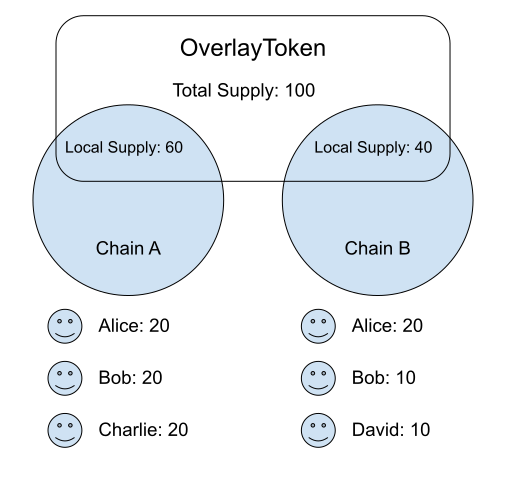
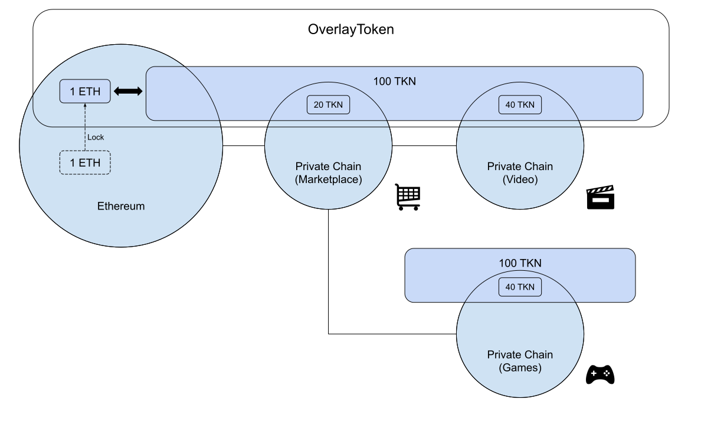
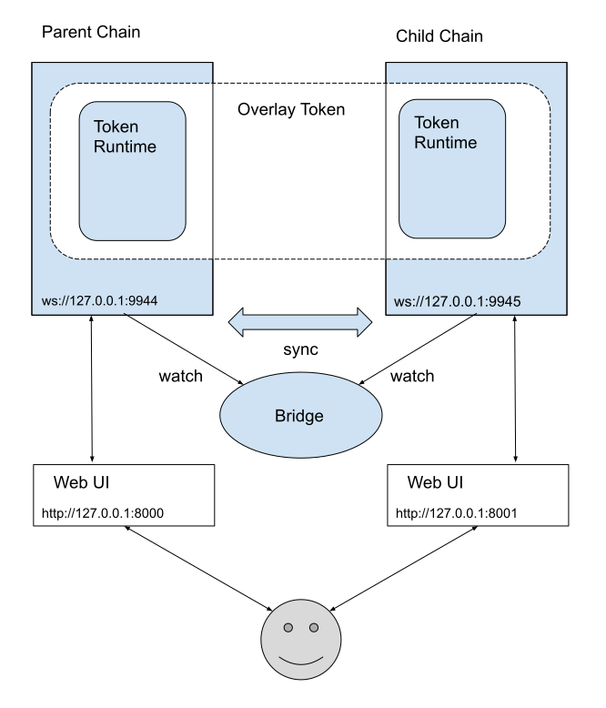
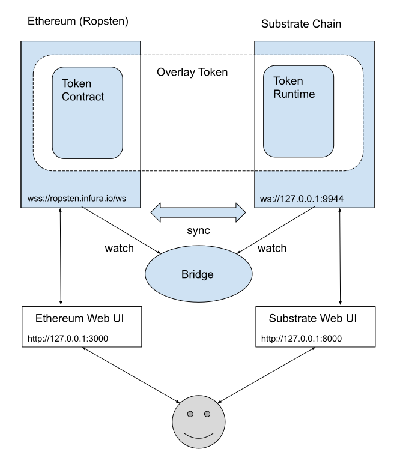

# Overlay Token
Overlay Token: A cross-chain token protocol for simple, better user experiences on multi-blockchain environments.

## Overview

Overlay token aims to realize simple, better user experiences around exchanging some token or assets between different blockchain.
It does not move existing assets into another blockchain, but creates the new assets
that provide well-designed data structures and user-friendly functions for asset exchange on the multi blockchain enviroments.

<p align="center"></p>

- Overlay token shares the `Total Supply` between two or more different blockchains.
- `Total Supply` is separated into the `Local Supply` of each blockchain.
- Each accounts on each chains can transfer the token in the scope of the `Local Supply` on the chain like a normal ERC20 token.
- `Local Supply` can be sent to another chain in the scope of the `Total Supply`.

<p align="center"></p>

- This is an example usecase of overlay token.
- You can create an overlay token between the Ethereum and three private chain.
- You can mint the token on the Ethereum network with collateral of some ETH.
- ETH-Locked overlay token can be used on any private chain with low transaction fee and low latency.
- You can exchange the token to ETH at anytime by moving the token into Ethereum chain.

## Demo movies

### Substrate <-> Substrate

[](http://www.youtube.com/watch?v=P4w2f_tFXpE "OverlayTokenDemo")

- The first demo is built on two different private chains made with substrate.
- When the left chain mints or burns some token, the `Total Supply` of the right chain is synchronized.
- When one chain sends some token to another chain, the amounts of `Local Supply` of left and right chains are updated at consistency.

### Ethereum <-> Substrate

[](http://www.youtube.com/watch?v=7gaCUYaVep4 "OverlayTokenRopstenDemo")

- The second demo is built on Ethereum (Ropsten) and substrate private chain.
- Mint transaction on the Ethereum needs some transaction fee and high latency (30~ sec)
- Transfer transaction on the private chain needs no transaction fee and low latency (~2 sec)

## Repositories

- [substrate-overlay-token](https://github.com/dmm-bclabs/substrate-overlay-token)
  - Substrate version of an overlay token implementation
- [substrate-overlay-token-bridge](https://github.com/dmm-bclabs/substrate-overlay-token-bridge)
  - Bridge implementation of overlay token between substrate chains
- [substrate-overlay-token-ui](https://github.com/dmm-bclabs/substrate-overlay-token-ui)
  - Web UI implementation of overlay token for substrate chain 
- [ethereum-overlay-token](https://github.com/dmm-bclabs/ethereum-overlay-token)
  - Ethereum version of an overlay token implementation
- [ethereum-overlay-token-bridge](https://github.com/dmm-bclabs/ethereum-overlay-token-bridge)
  -  Bridge implementation of overlay token between Ethereum and substrate chains
- [ethereum-overlay-token-ui](https://github.com/dmm-bclabs/ethereum-overlay-token-ui)
  - Web UI implementation of overlay token for Ethereum

## To play

### Substrate <-> Substrate

<p align="center"></p>

- You have to start 5 applications:
  - 1) Parent Chain
  - 2) Child Chain
  - 3) Bridge
  - 4) Parent Web UI
  - 5) Child Web UI

#### Start Parent Chain

```
$ git clone https://github.com/dmm-bclabs/substrate-overlay-token.git
$ cd substrate-overlay-token
    
$ ./scripts/build.sh
$ cargo build --release
    
$ ./target/release/substrate-overlay-token purge-chain --chain parent --base-path /tmp/parent -y
$ ./target/release/substrate-overlay-token --chain parent --charlie --validator --base-path /tmp/parent --ws-port 9944
```

#### Start Child Chain

```
$ cd substrate-overlay-token
    
$ ./target/release/substrate-overlay-token purge-chain --chain child --base-path /tmp/child -y
$ ./target/release/substrate-overlay-token --chain child --dave --validator --base-path /tmp/child --ws-port 9945
```

#### Start Bridge

```
$ git clone https://github.com/dmm-bclabs/substrate-overlay-token-bridge.git
$ cd substrate-overlay-token-bridge
    
$ yarn install
$ yarn run dev
```

### Start Parent Web UI

```
$ git clone https://github.com/dmm-bclabs/substrate-overlay-token-ui.git
$ cd substrate-overlay-token-ui
    
$ yarn install
$ PORT=8000 yarn run dev
```

### Start Child Web UI

```
$ cd substrate-overlay-token-ui
    
$ PORT=8001 yarn run dev
```

### Ethereum <-> Substrate

<p align="center"></p>

- You have to start 4  applications:
  - 1) Substrate Chain
  - 2) Bridge
  - 3) Ethereum Web UI
  - 4) Substrate Web UI
- Also overlay token is need to be deployed on the Ethereum testnet.


#### Start Substrate Chain

```
$ git clone https://github.com/dmm-bclabs/substrate-overlay-token.git
$ cd substrate-overlay-token
    
$ ./scripts/build.sh
$ cargo build --release
    
$ ./target/release/substrate-overlay-token purge-chain --chain parent --base-path /tmp/parent -y
$ ./target/release/substrate-overlay-token --chain parent --charlie --validator --base-path /tmp/parent --ws-port 9944
```

#### Start Bridge

```
$ git clone https://github.com/dmm-bclabs/ethereum-overlay-token-bridge.git
$ cd ethereum-overlay-token-bridge
    
$ yarn install
    
$ cp config/setting-default.json config/setting.json
# edit URL, OverlayToken Address and Private Key
$ vi config/setting.json
    
$ node index.js
```

- Create setting.json file, and edit URL of Ethereum testnet, the address of the overlay token contract, and the private key of the owner of the overlay token contract.
- For URL of Etheruem testnet, create account at infura.io.

#### Start Ethereum Web UI

```
$ git clone https://github.com/dmm-bclabs/ethereum-overlay-token-ui.git
$ cd ethereum-overlay-token-ui
    
$ yarn install
$ yarn start
```

#### Start Substrate Web UI

```
$ git clone https://github.com/dmm-bclabs/substrate-overlay-token-ui.git
$ cd substrate-overlay-token-ui
    
$ yarn install
$ PORT=8000 yarn run dev
```

- Execute init and setParent on the token segment.
- At setParent, fill the amount of token supply on the Ethereum contract as totalSupply.

## License

[LICENSE](./LICENSE)